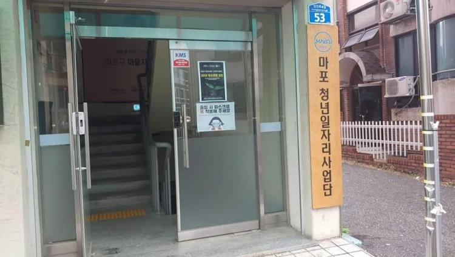

# 마포 청년 사업단

   
  
   

목차

## 프로젝트 소개

프로젝트 개요/동기

GIF Images

 

## 기술 스택

| JavaScript | TypeScript |  React   |  Node   |  css   |  html   |  notion   |
| :--------: | :--------: | :------: | :-----: | :----: | :-----: | :-------: |
|   ![js]    |   ![ts]    | ![react] | ![node] | ![css] | ![html] | ![notion] |

|  figma   |
| :------: |
| ![figma] |

 

## 구현 기능

### 기능 1

### 기능 2

### 기능 3

### 기능 4

 

## 배운 점 & 아쉬운 점

 

## 라이센스

MIT &copy; [NoHack](mailto:changwoon2@gmail.com)

<!-- Stack Icon Refernces -->

[js]: /readmeimg/javascript.svg
[ts]: /readmeimg/typescript.svg
[react]: /readmeimg/react.svg
[node]: /readmeimg/node.svg
[css]: /readmeimg/css.svg
[html]: /readmeimg/html.svg
[notion]: /readmeimg/notion.svg
[figma]: /readmeimg/figma.svg
