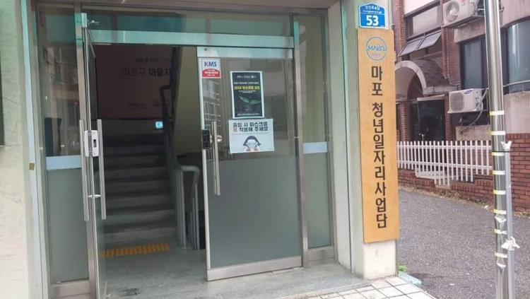

# 마포 청년 일자리 사업단

   
  
   

## 프로젝트 클론 사이트 소개

<h6> 마포청년사업단 구축 홈페이지</h6>
 
 

## 프로젝트 목표들

  <h6>인프런 패스트캠퍼스에서 배운 내용들을 적용하여 사이트 구축하기</h6>
  
   

## 진행기간

<h6>2022-06-01 ~</h6>

 

## 프로젝트 참여자

<h6>김연준 임창운 강대국</h6>

 

## 기술 스택

| JavaScript | TypeScript |  React   |  Node   |  css   |  html   |
| :--------: | :--------: | :------: | :-----: | :----: | :-----: |
|   ![js]    |   ![ts]    | ![react] | ![node] | ![css] | ![html] |

|  figma   |  notion   |  React-native   |
| :------: | :-------: | :-------------: |
| ![figma] | ![notion] | ![react-native] |

 

## 구현 기능

### 기능 1

### 기능 2

### 기능 3

### 기능 4

 

## 배운 점 & 아쉬운 점

 

## 라이센스

MIT &copy; [NoHack](mailto:changwoon2@gmail.com)

<!-- Stack Icon Refernces -->

[js]: /images/readme/javascript.svg
[ts]: /images/readme/typescript.svg
[react]: /images/readme/react.svg
[node]: /images/readme/node.svg
[css]: /images/readme/css.svg
[html]: /images/readme/html.svg
[notion]: /images/readme/notion.svg
[figma]: /images/readme/figma.svg
[react-native]: /images/readme/react-native.svg
